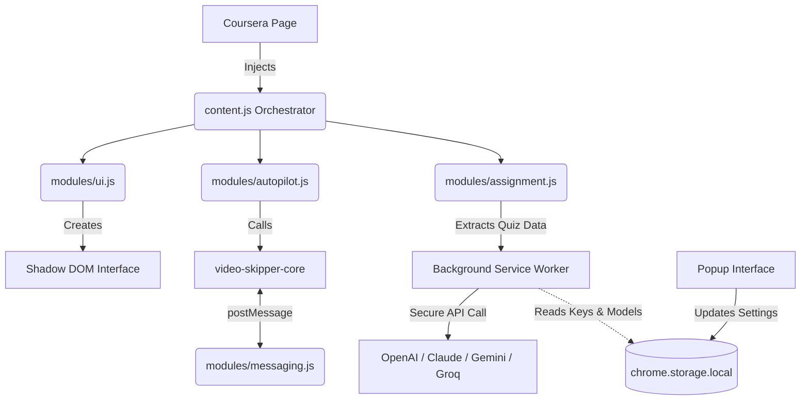

  
    
  
  

    
    
    
    
  

  

    <b>A premium, intelligent, and highly secure Chrome Extension designed to drastically speed up and semi-automate the Coursera learning experience.</b>
  

  
<b>📖 Table of Contents</b>

  <ul>
    <li><a href="#-what-exactly-does-courseflow-provide">What Exactly Does CourseFlow Provide?</a></li>
    <li><a href="#-architecture--tech-stack">Architecture & Tech Stack</a></li>
    <li><a href="#-security-posture">Security Posture</a></li>
    <li><a href="#-how-to-install--use">How to Install & Use</a></li>
    <li><a href="#-uiux-design">UI/UX Design</a></li>
  </ul>

 

<h2>🚀 What Exactly Does CourseFlow Provide?</h2>

CourseFlow transforms your learning experience into a frictionless flow through two primary capabilities. It tackles the most tedious aspects of online learning by automatically fast-forwarding and skipping video lectures across deeply nested iframes, and provides a powerful, multi-provider AI assistant to help you solve quizzes and assignments instantly.

<h3>🎥 1. Video Auto-Pilot & Skipper</h3>

Coursera often requires users to manually watch videos and click "Next" to progress. Coursera's architecture also hides these videos inside complex, deeply nested iframes, making typical automation scripts fail. 

<ul>
  <li><b>Instant Completion:</b> Automatically detects HTML5 videos and instantly seeks them to the very end (saving hours of watching).</li>
  <li><b>Auto-Advance:</b> Automatically finds and clicks the "Mark as Completed" or "Next" buttons to advance you to the next module seamlessly.</li>
  <li><b>Hands-Free Mode:</b> Leave it running in "Auto-Pilot" mode, and it will effortlessly chew through your video backlog.</li>
</ul>

<h3>🧠 2. Smart AI Quiz Assistant</h3>

When you reach a quiz or assignment, CourseFlow acts as your personal tutor.

<ul>
  <li><b>Auto-Extraction:</b> The extension automatically extracts multiple-choice questions, short-answer prompts, and options from the page.</li>
  <li><b>Bring Your Own Key (BYOK):</b> Send the quiz to your preferred AI model! We support <b>Groq, Anthropic (Claude), Google (Gemini), and OpenAI (ChatGPT)</b>.</li>
  <li><b>"Memorize Mistakes" System:</b> If you fail a quiz, click the "Memorize Mistakes" button on the feedback page. The extension scans the page, extracts exactly which options you got wrong, and saves them locally. On your next attempt, it feeds those known incorrect answers to the AI, guaranteeing it <b>never makes the same mistake twice</b>.</li>
</ul>

<h2>🛠️ Architecture & Tech Stack</h2>

CourseFlow is built using <b>Vanilla JavaScript, HTML, and CSS</b>, strictly adhering to the latest <b>Manifest V3</b> standards. It requires no heavy frameworks (like React or Vue), making it blazingly fast and lightweight.

<h3>Key Technical Highlights:</h3>
<table>
  <tr>
    <td width="150">🛡️ <b>Shadow DOM UI</b></td>
    <td>The extension's interface is injected into the Coursera webpage using a <code>Shadow DOM</code>. This completely isolates the extension's CSS, ensuring Coursera's website styles never break the UI, and the extension never breaks Coursera.</td>
  </tr>
  <tr>
    <td width="150">📡 <b>Cross-Frame Messaging</b></td>
    <td>CourseFlow uses a sophisticated <code>postMessage</code> router to securely communicate between the top-level webpage and Coursera's nested LTI tool iframes to locate and manipulate the hidden video players.</td>
  </tr>
</table>

<h2>🔒 Security Posture</h2>

CourseFlow was engineered with strict security standards to ensure your browser and API keys remain safe.

<ul>
  <li><b>API Keys are 100% Safe:</b> Your API keys are saved exclusively in the extension's isolated <code>chrome.storage.local</code>. They are <b>never</b> exposed to the web page or the content scripts. Only the isolated Background Service Worker (<code>background.js</code>) accesses them to make direct, secure API calls.</li>
  <li><b>Zero XSS Vulnerabilities:</b> The extension rigorously avoids using <code>innerHTML</code> to render external data. All AI responses, quiz questions, and options are securely injected into the DOM using <code>.textContent</code>. This guarantees that if a quiz contains malicious HTML script tags, the browser will treat them strictly as plain text.</li>
  <li><b>Strict Permission Scoping:</b> The extension only requests host permissions for exactly four URLs (Groq, Anthropic, Gemini, and OpenAI APIs) and strictly limits content script execution to <code>coursera.org/learn/*</code>.</li>
</ul>

<h2>💻 How to Install & Use</h2>

<h3>1️⃣ Installation</h3>
<ol>
  <li>Clone or download this repository to your local machine.</li>
  <li>Open Google Chrome and navigate to <code>chrome://extensions/</code>.</li>
  <li>Enable <b>Developer mode</b> (toggle switch in the top right corner).</li>
  <li>Click <b>Load unpacked</b> and select the folder containing this project.</li>
</ol>

<h3>2️⃣ Setup Your AI</h3>
<ol>
  <li>Click the CourseFlow icon in your Chrome toolbar.</li>
  <li>Select your preferred <b>AI Provider</b> from the visually stunning dashboard.</li>
  <li>Choose a model from the dropdown (or enter a custom model ID).</li>
  <li>Enter your API Key. (There are direct links in the UI to get your keys if you don't have them).</li>
  <li>Click <b>Save Settings</b>.</li>
</ol>

<h3>3️⃣ Using the Extension</h3>
<ul>
  <li><b>Auto-Pilot:</b> Navigate to a Coursera course page. You will see a premium, floating CourseFlow UI at the bottom right of the screen. Click the <b>Start Auto-Pilot</b> button (or start it from the extension popup). Sit back and watch the animated flow pipeline as it skips your videos!</li>
  <li><b>Assignments:</b> When you land on a quiz page, two new buttons will appear in the floating UI:
    <ul>
      <li><b>Get AI Answers:</b> Extracts the quiz, sends it to your chosen AI, and displays the correct answers directly on the screen.</li>
      <li><b>Memorize Mistakes:</b> If you get a less-than-perfect score, go to the quiz feedback page and click this button. CourseFlow will memorize what you got wrong to ensure a better score on the retry.</li>
    </ul>
  </li>
</ul>

<h2>🎨 UI/UX Design</h2>

The popup extension interface was completely overhauled to feature a premium, sleek, and high-tech "SaaS" aesthetic. It includes glassmorphism, soft drop shadows, glowing gradient buttons, and a fully animated 3-step pipeline flow diagram that visually reacts when the Auto-Pilot is running, giving you real-time feedback on what the extension is processing behind the scenes.

 

  <i>Disclaimer: This extension is intended for educational and developmental purposes to demonstrate advanced DOM manipulation, Cross-Origin iframe communication, and AI API integrations. Please adhere to your institution's honor code policies.</i>

