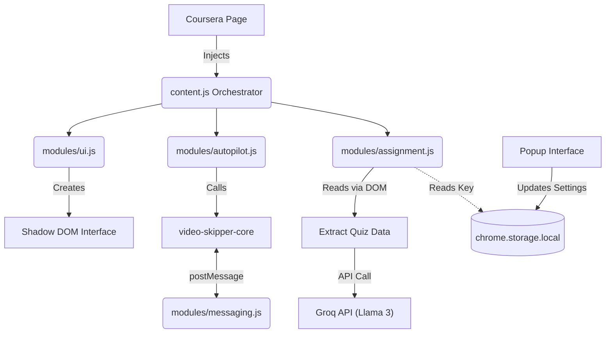

# CourseFlow

CourseFlow is an intelligent, automated companion for Coursera. It helps you seamlessly navigate through video lectures, automatically skip repetitive elements, and offers an AI-powered assistant for assignments, transforming your learning experience into a frictionless flow.

## 🚀 Features

- **Auto-Pilot Navigation**: Automatically clicks "Next" when a video finishes. No more manual clicking between lectures.
- **Video Skipper**: Forces videos to complete instantly across Coursera's complex iframe architecture, saving hours of manual watching.
- **Smart Assignment Helper (Beta)**:
  - Connects to the Groq AI API for instant multiple-choice quiz assistance.
  - Features a **"Memorize Mistakes"** system: If you get answers wrong, the AI learns from your mistakes and guarantees it won't pick them on your next attempt.
- **Cross-Frame Architecture**: Bypasses Coursera's deeply nested iframes with a lightweight cross-document messaging system.

## 🛠️ Architecture

CourseFlow's codebase is heavily modularized to guarantee stability, security, and maintainability.

### Module Breakdown:
1. **`content.js`**: The orchestrator. Monitors URL changes and page loads to inject controls.
2. **`modules/utils.js`**: Core helper functions (domain checks, wait functions).
3. **`modules/messaging.js`**: A robust `postMessage` router that bypasses same-origin policy restrictions when penetrating Coursera's LTI tool iframes.
4. **`modules/autopilot.js`**: The main execution loop for Auto-pilot and video skipping.
5. **`modules/assignment.js`**: Quiz DOM extraction, Mistake Memorization, and LLM inference logic.
6. **`modules/ui.js`**: Creates a secure, isolated Shadow DOM to inject the floating UI elements without conflicting with Coursera's native CSS.

## 🔒 Security Posture

CourseFlow was built with modern extension security standards in mind:
- **No `innerHTML` usage**: All dynamic data relies on `textContent` and `innerText` to completely eliminate Cross-Site Scripting (XSS) vulnerabilities.
- **Local Storage Isolation**: Your Groq API keys are stored securely in `chrome.storage.local` within the extension sandbox, invisible to the host webpage.
- **Strict Message Passing**: The cross-frame messaging architecture strictly validates `event.source === window.parent` to prevent malicious iframe hijacking.

## 💻 How to Use

1. **Install the Extension**: Load the unpacked folder via `chrome://extensions/`.
2. **Set up AI (Optional)**: Click the extension icon in your Chrome toolbar, go to the **Assignments** tab, and enter your Groq API Key.
3. **Start Auto-Pilot**: When on a Coursera course page, you will see a small floating UI at the bottom right. Click **Start Auto-Pilot** to automatically play and skip through videos.
4. **Assignment Helper**: When you land on a quiz attempt page, two new buttons will appear in the floating UI:
   - **Get AI Answers**: Scrapes the quiz, asks the AI, and displays the answers in a floating popup.
   - **Memorize Mistakes**: If you fail a quiz, click this on the feedback page! It will store the incorrect options so the AI never repeats them on your retry.

## 🔮 Upcoming Features

I am actively expanding CourseFlow to become the ultimate learning copilot. The roadmap includes:
- **Automatic Peer Review System**: AI-driven analysis of peer-graded assignments to help you provide constructive, high-quality reviews automatically.
- **Multiple AI Model Support**: Soon, you won't be limited to just Groq. I am adding native support for **Google Gemini** and **Anthropic Claude**.
- **Model Selection UI**: A new settings panel to easily toggle between models based on your preference for speed (Groq) or complex reasoning (Claude/Gemini).
